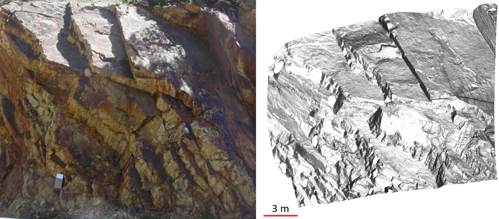
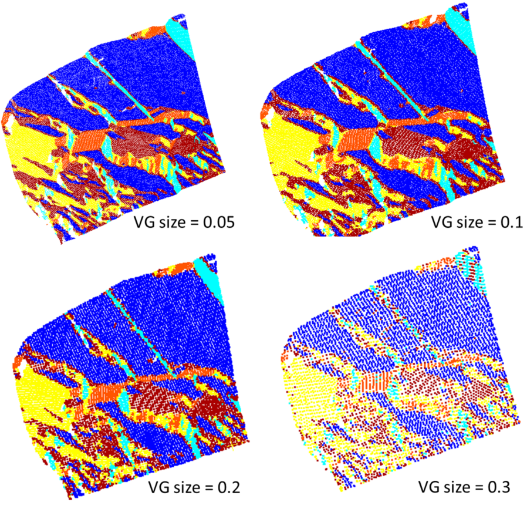
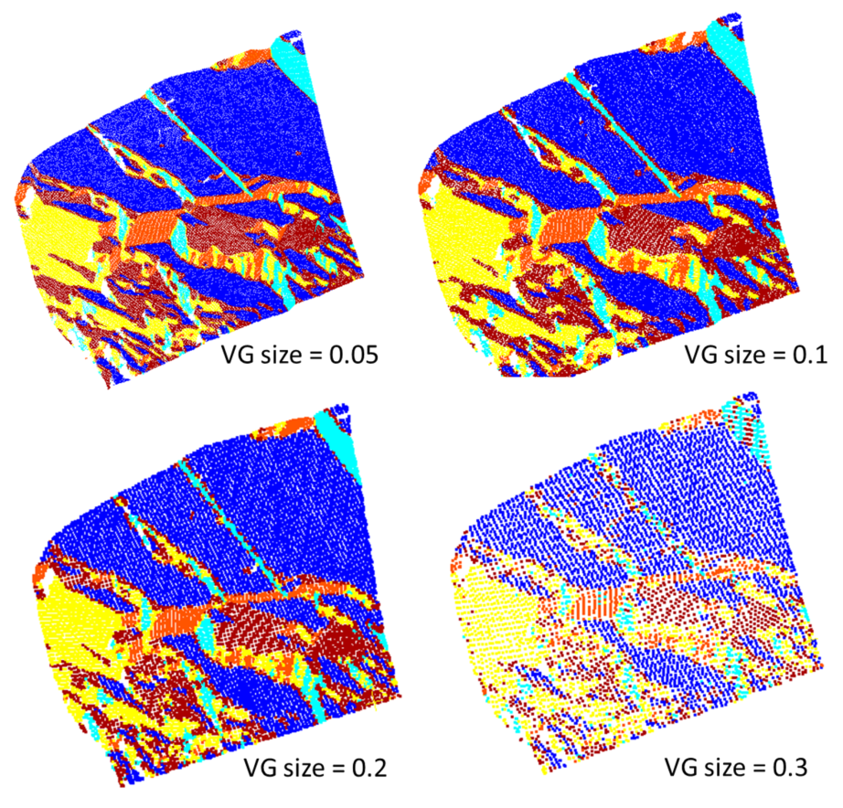

# 3D Point cloud semantic and instance segmentation

A computationally efficient workflow was developed using Python to perform semantic and instance segmentation and then measure the intended geometrical features from the extracted instance segment on  3D point clouds of rock structures for hazard monitoring. The project in this workflow includes several steps such as data acquisition, preprocessing, data labeling, exploratory data analysis, data transformation, model building, evaluation, optimization, hyperparameter tuning, deployment, and monitoring. Point clouds are acquired from LiDAR or Photogrammetry and 3D reconstruction techniques. Unsupervised learning methods were employed to build a model for feature selection. The segmentation results were improved with a precision up to 92%. A robust-to-noise model was built with deterministic segmentation results. The computational cost was reduced from O(n^2) to O(n log n).


## Set up new virtual environment
To create a virtual environment:

```bash
$ python3 -m venv venv
```

## Installation

To install the required libraries using ```pip```:

```bash
pip install -r requirements.txt
```

## Run code
To run the code, use the following command:

```bash
python main.py
```

# Examples, results and comparison

Here is the first example of an image and the corresponding point cloud:



## Effects of knn on the segmentation results 



## Effects of voxel grid (VG) size on the  segmentation results:


## Second example: raw and labeled point cloud


## Performance metrics for the discontinuity planes extracted 
| Plane No.      | Precision (%)  | Recall (%) | F1 (%) | IOU(%) |
|----------------|----------------|----------------|----------------|----------------|
| 1              | 99.8   | 95.1             | 97.4          |94.8|
| 2              | 95.5   | 96.4             | 96.0          |92.2|
| 3              | 93.4   | 95.5             | 94.5          |89.5|
| 5              | 92.0   | 90.5             | 91.2          |83.8|
| 6              | 98.2   | 90.8             | 94.4          |89.4|
| 7              | 82.5   | 80.7             | 81.6          |68.9|
| 8              | 91.9   | 91.8             | 91.9          |85.0|
| 9              | 69.0   | 86.7             | 76.8          |62.4|
| 12             | 98.3   | 81.9             | 89.4          |80.8|
| 13             | 98.8   | 92.9             | 95.8          |91.9|
| 14             | 92.6   | 71.6             | 80.7          |67.7|
| 15             | 100    | 73.3             | 84.6          |73.3|
| 17             | 91.8   | 89.7             | 90.7          |83.0|
| 19             | 87.5   | 70.7             | 78.2          |64.2|
| Ave.           | 92.2   | 86.3             | 88.8          |80.5|


